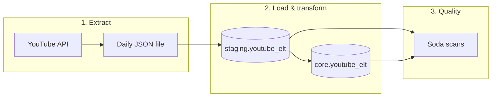

# YouTube ELT Pipeline

An end-to-end data engineering project that extracts YouTube channel video statistics, loads them into PostgreSQL using a staging-and-core pattern, and validates data quality with Soda. Orchestration is handled by Apache Airflow running in Docker with a Celery executor.

## Overview

The pipeline pulls video metadata and engagement metrics from the [YouTube Data API v3](https://developers.google.com/youtube/v3), persists a daily JSON snapshot, loads rows into PostgreSQL, promotes data from a **staging** schema to **core**, and runs automated quality checks on both layers.



Three Airflow DAGs run in sequence (via `TriggerDagRunOperator`):

| DAG | Schedule | Purpose |
|-----|----------|---------|
| `produce_json` | Daily | Fetch playlist → video IDs → video stats → save JSON |
| `update_db` | Triggered | Load JSON into `staging`, transform into `core` |
| `data_quality` | Triggered | Soda checks on `staging` and `core` |

## Tech stack

| Layer | Technology |
|-------|------------|
| Orchestration | Apache Airflow 3.x (CeleryExecutor) |
| Runtime | Docker, Docker Compose |
| Language | Python 3.12 |
| Database | PostgreSQL (host or container) |
| API | YouTube Data API v3 |
| Data quality | Soda Core (Postgres) |
| CI/CD | GitHub Actions |

## Project structure

```
Youtube-ETL/
├── dags/
│   ├── main.py                 # DAG definitions and triggers
│   ├── api/video_stat.py       # YouTube API tasks (TaskFlow)
│   ├── datawarehouse/          # Staging/core load and transforms
│   └── dataquality/soda.py     # Soda BashOperator tasks
├── include/soda/               # Soda configuration and checks
├── tests/                      # Unit and integration tests
├── data/                       # Daily JSON output (gitignored in practice)
├── Dockerfile                  # Custom Airflow image
├── docker-compose.yaml         # Local Airflow stack (+ CI Postgres profile)
├── requirements.txt            # Python dependencies for the image
└── .github/workflows/          # Build, push, and test pipeline
```

## Prerequisites

- [Docker Desktop](https://www.docker.com/products/docker-desktop/) (macOS or Linux)
- PostgreSQL on your machine **or** use the CI Postgres profile (see below)
- [YouTube Data API key](https://console.cloud.google.com/apis/credentials)
- (Optional) [pgAdmin](https://www.pgadmin.org/) for inspecting databases

Create these databases on your Postgres server before first run:

- `YoutubeDB` — ELT data (`staging` / `core` schemas)
- `airflow_metadata` — Airflow metadata
- `airflow_celery` — Celery result backend

## Configuration

Copy environment variables into a `.env` file in the project root (never commit this file).

```bash
# YouTube
YOUTUBE_API_KEY=your_api_key
CHANNEL_HANDLE=MrBeast

# Docker image (local)
DOCKERHUB_NAMESPACE=your_dockerhub_user
DOCKERHUB_REPOSITORY=youtube_data_elt
IMAGE_TAG=1.0.1

# Postgres (Mac host — containers use host.docker.internal)
POSTGRES_CONN_USERNAME=postgres
POSTGRES_CONN_PASSWORD=your_password
POSTGRES_CONN_HOST=host.docker.internal
POSTGRES_CONN_PORT=5432
POSTGRES_CONN_HOST_LOCAL=localhost

# ELT database
ELT_DATABASE_NAME=YoutubeDB
ELT_DATABASE_USERNAME=postgres
ELT_DATABASE_PASSWORD=your_password

# Airflow metadata & Celery (same server)
METADATA_DATABASE_NAME=airflow_metadata
METADATA_DATABASE_USERNAME=postgres
METADATA_DATABASE_PASSWORD=your_password
CELERY_BACKEND_NAME=airflow_celery
CELERY_BACKEND_USERNAME=postgres
CELERY_BACKEND_PASSWORD=your_password

# Airflow
AIRFLOW_UID=50000
AIRFLOW_WWW_USER_USERNAME=airflow
AIRFLOW_WWW_USER_PASSWORD=your_password
FERNET_KEY=generate_with_python_cryptography_fernet

# Soda
SCHEMA=staging
```

Generate a Fernet key:

```bash
python -c "from cryptography.fernet import Fernet; print(Fernet.generate_key().decode())"
```

Airflow reads DAG variables from the environment:

- `AIRFLOW_VAR_YOUTUBE_API_KEY` ← `YOUTUBE_API_KEY`
- `AIRFLOW_VAR_CHANNEL_HANDLE` ← `CHANNEL_HANDLE`

Connection `POSTGRES_DB_YT_ELT` is built from the `ELT_*` and `POSTGRES_CONN_*` variables in `docker-compose.yaml`.

## Local development

### 1. Build the Airflow image

```bash
docker build -t benofurhie/youtube_data_elt:1.0.1 .
```

Adjust the tag to match `DOCKERHUB_NAMESPACE`, `DOCKERHUB_REPOSITORY`, and `IMAGE_TAG` in `.env`.

### 2. Start the stack

Uses Postgres on your Mac (`host.docker.internal`):

```bash
docker compose up -d
```

Airflow UI: [http://localhost:8081](http://localhost:8081) (login from `AIRFLOW_WWW_USER_*` in `.env`).

### 3. Run DAGs

Unpause DAGs in the UI, or trigger from the CLI:

```bash
docker exec airflow-worker airflow dags trigger produce_json
```

JSON files are written to `data/youtube_data_YYYY-MM-DD.json` inside the container (`/opt/airflow/data`).

### CI-style Postgres (optional)

To run the same Postgres setup as GitHub Actions locally:

```bash
export POSTGRES_CONN_HOST=postgres
docker compose --profile ci up -d --wait
```

## Data model

| Schema | Table | Role |
|--------|-------|------|
| `staging` | `youtube_elt` | Raw-style load from JSON; upserts by `Video_ID` |
| `core` | `youtube_elt` | Transformed layer (e.g. `Video_Type`, `Duration` as `TIME`) |

Tables are created automatically by the `update_db` DAG if they do not exist.

## Data quality

Checks live in `include/soda/checks.yml` (missing/duplicate keys, likes/comments vs views). Each run scans `youtube_elt` in the given schema:

```bash
set -a && source .env && set +a
export POSTGRES_CONN_HOST="${POSTGRES_CONN_HOST_LOCAL:-localhost}"
soda scan -d pg_datasource \
  -c include/soda/configuration.yml \
  include/soda/checks.yml \
  -v SCHEMA=staging
```

## Testing

Tests live under `tests/`:

| File | Scope |
|------|--------|
| `test_unit.py` | Mocked variables, connections, DAG integrity |
| `test_integration.py` | Live YouTube API and Postgres (requires `.env`) |

Run locally with a virtualenv:

```bash
python -m venv youtube-venv && source youtube-venv/bin/activate
pip install -r requirements.txt
set -a && source .env && set +a
export AIRFLOW_HOME="$PWD/.pytest_airflow" AIRFLOW__CORE__LOAD_EXAMPLES=False
export AIRFLOW_VAR_YOUTUBE_API_KEY="$YOUTUBE_API_KEY" AIRFLOW_VAR_CHANNEL_HANDLE="$CHANNEL_HANDLE"
export POSTGRES_CONN_HOST="${POSTGRES_CONN_HOST_LOCAL:-localhost}"
pytest tests/ -v
```

Or inside the running worker:

```bash
docker exec airflow-worker pytest tests/ -v
```

## CI/CD

Workflow: [`.github/workflows/ci-cd-elt.yaml`](.github/workflows/ci-cd-elt.yaml)

| Job | When it runs | What it does |
|-----|----------------|--------------|
| **build-and-push-image** | `Dockerfile`, `requirements.txt`, or `docker-compose.yaml` change | Push image to Docker Hub (`:latest` and `:${{ github.sha }}`) |
| **unit-and-integration-and-e2e-tests** | DAGs, tests, include, or workflow change | Build image on runner, start stack with `--profile ci`, run `pytest` and `airflow dags test` |

Configure [GitHub Actions secrets and variables](https://docs.github.com/en/actions/security-for-github-actions/security-guides/using-secrets-in-github-actions) to mirror your `.env` (see workflow `env` block for names). CI uses an ephemeral Postgres service in Compose, not your Mac host.

## Docker Hub

Default image reference:

```text
benofurhie/youtube_data_elt:<tag>
```

Push after building locally:

```bash
docker login
docker push benofurhie/youtube_data_elt:1.0.1
docker push benofurhie/youtube_data_elt:latest
```

## Troubleshooting

| Issue | Likely cause |
|-------|----------------|
| `Variable YOUTUBE_API_KEY not found` | Missing `YOUTUBE_API_KEY` in `.env` / compose env |
| Connection refused to Postgres | Wrong `POSTGRES_CONN_HOST` (use `host.docker.internal` in Docker, `localhost` on host) |
| DAG import errors in tests | Run from repo root; ensure `dags/` is on `PYTHONPATH` or use `conftest.py` fixtures |
| CI cannot pull `:latest` | Expected: CI builds the image on the runner; Hub push is only from the build job |

## License

This project is for educational and portfolio use. Respect the [YouTube API Terms of Service](https://developers.google.com/youtube/terms/api-services-terms-of-service) and API quota limits.
