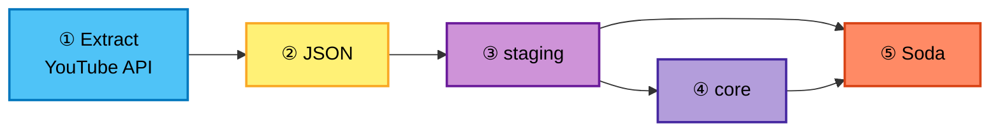
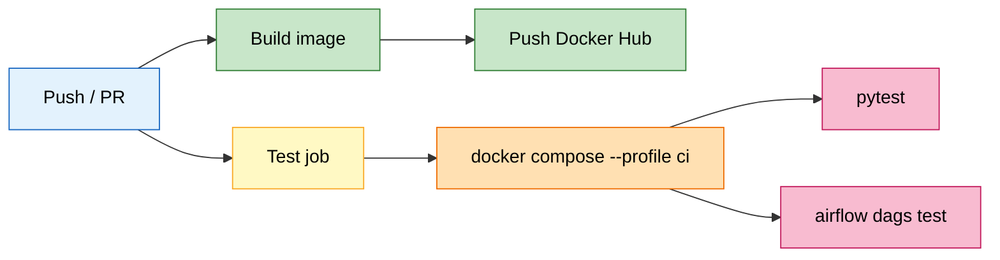

# YouTube Data ETL Pipeline

ELT pipeline for YouTube channel video stats: **API → JSON → PostgreSQL (staging → core) → Soda**, orchestrated with **Apache Airflow** in Docker. Includes **pytest** coverage and a **GitHub Actions** CI/CD workflow.

---

## Overview

Configurable channel handle → daily extract from **YouTube Data API v3** → load/upsert **staging** → transform **core** → **Soda** quality checks on both schemas.

Three DAGs, chained with `TriggerDagRunOperator`: **`produce_json`** (daily) → **`update_db`** → **`data_quality`**.

| DAG | Role |
|-----|------|
| `produce_json` | API → daily JSON file |
| `update_db` | Staging upsert → core transform |
| `data_quality` | Soda on `staging`, then `core` |

---

## Tech stack

Python 3.12 · Apache Airflow 3 (Celery, Redis) · PostgreSQL · YouTube Data API v3 · Soda Core · Docker / Compose · Docker Hub · **pytest** · **GitHub Actions**

---

## Testing

| Layer | What runs |
|-------|-----------|
| **Unit** | DAG import integrity, mocked Airflow variables and Postgres connection (`tests/test_unit.py`) |
| **Integration** | Live YouTube API response and Postgres `SELECT 1` (`tests/test_integration.py`) |

Tests run locally with `pytest tests/ -v` or inside the Airflow worker container after `docker compose up`.

---

## CI/CD

Workflow: [`.github/workflows/ci-cd-elt.yaml`](.github/workflows/ci-cd-elt.yaml)

| Job | Purpose |
|-----|---------|
| **build-and-push-image** | Build custom Airflow image; push `:latest` and `:$SHA` to Docker Hub |
| **unit-and-integration-and-e2e-tests** | Build image on runner, start stack with CI Postgres, run **pytest** and **`airflow dags test`** on all three DAGs |

Path filters skip jobs when unrelated files change. Secrets and variables in GitHub mirror `.env` (API key, DB credentials, Fernet key, Docker Hub).

---

## Repository

`dags/` · `include/soda/` · `tests/` · `Dockerfile` · `docker-compose.yaml` · `.github/workflows/`

---

## License

MIT · YouTube API use subject to [Google’s terms](https://developers.google.com/youtube/terms/api-services-terms-of-service).
