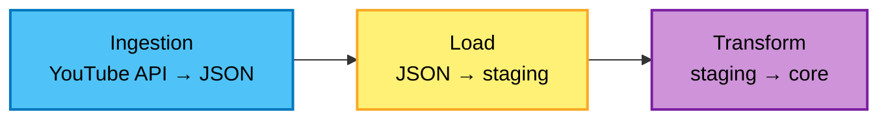

# YouTube Data ELT Pipeline

[](https://www.python.org/)
[](https://opensource.org/licenses/MIT)

End-to-end **ELT** pipeline for YouTube channel analytics: extract video statistics from the **YouTube Data API v3**, land them in **PostgreSQL** using a **staging → core** pattern, and validate with **Soda**. **Apache Airflow** schedules and chains the work; **Docker** runs the stack locally and in **GitHub Actions** CI.

---

## About this project

The pipeline targets a single channel (configured via Airflow variable `CHANNEL_HANDLE`). Each run collects playlist and video metadata—titles, publish dates, duration, views, likes, and comments—and persists them for reporting and quality monitoring.

**Orchestration:** Three Airflow DAGs form one workflow. `produce_json` runs on a **daily schedule**; `update_db` and `data_quality` start only when the previous DAG finishes (`TriggerDagRunOperator`). Extraction uses **TaskFlow** (`@task`); warehouse logic uses Python operators against Postgres; quality uses **BashOperator** + Soda CLI.

**Data flow:** API responses are written to a dated JSON file, loaded into `staging.youtube_elt`, transformed into `core.youtube_elt`, then scanned by Soda on both schemas.

**Engineering:** Custom Airflow image (Celery + Redis), `pytest` (unit + integration), and a CI workflow that builds the image, runs tests in Compose with ephemeral Postgres, and executes `airflow dags test` on every DAG.

---

## Data flow

Apache Airflow runs three DAGs (`produce_json` → `update_db` → `data_quality`) that map to the stages below.



**Ingestion** — fetch playlist and video stats from the API; write `youtube_data_YYYY-MM-DD.json`.

**Load** — read JSON; upsert rows into `staging.youtube_elt`.

**Transform** — apply business rules; load `core.youtube_elt`. Soda then validates both schemas.

---

## Tech stack


Python 3.12 · Airflow 3 (CeleryExecutor, Redis) · PostgreSQL · YouTube Data API v3 · Soda Core · Docker / Docker Hub · pytest · GitHub Actions

---

## Repository structure

```
├── dags/
│   ├── main.py              # DAG definitions and triggers
│   ├── api/                 # YouTube extraction (TaskFlow)
│   ├── datawarehouse/       # Staging / core ELT
│   └── dataquality/         # Soda tasks
├── include/soda/            # Soda config and checks
├── tests/                   # Unit + integration tests
├── Dockerfile
├── docker-compose.yaml
└── .github/workflows/       # CI/CD
```

---

## Testing and CI/CD

**Tests** — `tests/test_unit.py` checks DAG integrity with mocks; `tests/test_integration.py` hits the live API and Postgres. Run with `pytest tests/ -v` or inside the `airflow-worker` container.

**CI/CD** — [`.github/workflows/ci-cd-elt.yaml`](.github/workflows/ci-cd-elt.yaml) builds and pushes the image to Docker Hub when the Dockerfile or dependencies change; on DAG or test changes it builds locally on the runner, starts `docker compose --profile ci`, runs **pytest**, then **`airflow dags test`** for `produce_json`, `update_db`, and `data_quality`.

---

## License

MIT · [YouTube API Terms of Service](https://developers.google.com/youtube/terms/api-services-terms-of-service)
