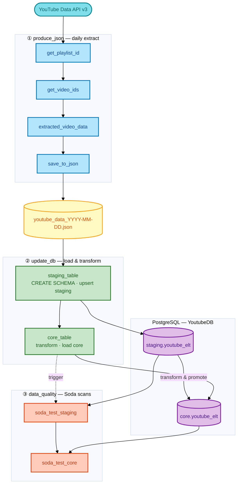

# YouTube ELT Pipeline

An end-to-end **extract–load–transform** pipeline for YouTube channel analytics. The project pulls video statistics from the YouTube Data API, lands them in PostgreSQL using a **staging → core** warehouse pattern, and validates both layers with **Soda**—all orchestrated by **Apache Airflow** in Docker, with automated testing in **GitHub Actions**.

## What I built

I designed three linked Airflow DAGs that run as a single logical pipeline. The first DAG runs on a daily schedule; the others are triggered when the previous stage finishes.

**1. Extract (`produce_json`)**  
TaskFlow tasks resolve the channel’s uploads playlist, paginate video IDs, call the Videos API for statistics (title, publish date, duration, views, likes, comments), and write a dated JSON file under `/opt/airflow/data`. A trigger starts the warehouse DAG.

**2. Load & transform (`update_db`)**  
Python tasks read the JSON file, create schemas and the `youtube_elt` table if needed, and upsert into **staging**. Rows are updated or inserted by `Video_ID`. The **core** layer applies business rules—such as classifying short vs long-form video type and normalizing duration—before data is promoted from staging. Another trigger starts quality checks.

**3. Data quality (`data_quality`)**  
Soda scans `staging.youtube_elt` and `core.youtube_elt` for missing or duplicate keys and for metrics that fail sanity rules (for example, likes or comments greater than views).

Infrastructure-wise, I packaged a **custom Airflow 3 image** (Celery executor, Redis broker, Postgres for metadata, Celery results, and the ELT database). I added **unit and integration tests** (mocked DAG integrity plus live API/DB checks) and a **CI/CD workflow** that builds the image, runs pytest inside the stack, and executes `airflow dags test` against an ephemeral Postgres instance.

## Pipeline flow



| DAG | Schedule | Tasks (summary) |
|-----|----------|-----------------|
| `produce_json` | `@daily` | Playlist → video IDs → API extract → JSON file → trigger `update_db` |
| `update_db` | Triggered | Staging upsert → core transform → trigger `data_quality` |
| `data_quality` | Triggered | Soda on `staging`, then Soda on `core` |

## Data model

| Schema | Table | Contents |
|--------|-------|----------|
| `staging` | `youtube_elt` | Raw-aligned fields from JSON; insert/update by `Video_ID` |
| `core` | `youtube_elt` | Transformed attributes (e.g. `Video_Type`, `Duration` as `TIME`) |

Quality rules in `include/soda/checks.yml` enforce row-level integrity and business sanity on both tables.

## Tech stack

| Area | Tools |
|------|--------|
| Orchestration | Apache Airflow 3.0 (CeleryExecutor, TaskFlow API, `TriggerDagRunOperator`) |
| Language | Python 3.12 |
| Storage | PostgreSQL (`staging`, `core`, Airflow metadata, Celery backend) |
| Messaging | Redis (Celery broker) |
| Containers | Docker, Docker Compose, custom image on Docker Hub |
| Source API | YouTube Data API v3 |
| Data quality | Soda Core + Postgres adapter |
| CI/CD | GitHub Actions (path-based jobs, local image build in tests, pytest + DAG tests) |
| Testing | pytest (unit mocks + integration against API and Postgres) |

## Repository layout

```
dags/
  main.py              DAG definitions and cross-DAG triggers
  api/video_stat.py    YouTube extraction tasks
  datawarehouse/       Staging/core load, transforms, utilities
  dataquality/soda.py  Soda BashOperator wrappers
include/soda/          Datasource config and check definitions
tests/                 Unit and integration test suite
Dockerfile             Airflow image with constraints-based pip install
docker-compose.yaml    Celery Airflow stack (+ optional CI Postgres profile)
.github/workflows/     Build, push, and test pipeline
```
