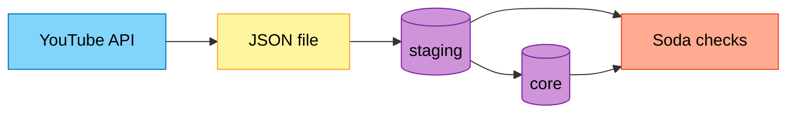

# YouTube ELT Pipeline

End-to-end pipeline: extract YouTube channel video stats via API, load into PostgreSQL (**staging → core**), validate with **Soda**, orchestrated in **Apache Airflow** (Docker + GitHub Actions CI).

## What I built

Three chained DAGs (`produce_json` → `update_db` → `data_quality`) pull data from the **YouTube Data API v3**, save a daily JSON file, upsert into **staging**, transform into **core**, then run **Soda** checks on both schemas. TaskFlow handles extraction; Python tasks handle the warehouse; triggers link each DAG. The stack runs in a custom **Airflow 3** image (Celery, Redis, Postgres) with **pytest** and **GitHub Actions** for automated tests.

## Pipeline flow



| DAG | Role |
|-----|------|
| `produce_json` | Daily API extract → JSON |
| `update_db` | Load staging, transform to core |
| `data_quality` | Soda on `staging` and `core` |

## Tech stack

Apache Airflow 3 · Python 3.12 · PostgreSQL · Docker / Compose · YouTube Data API v3 · Soda Core · Redis · GitHub Actions · pytest

## Repository layout

```
dags/              API, warehouse, and quality DAG code
include/soda/      Soda config and checks
tests/             Unit and integration tests
Dockerfile         Custom Airflow image
docker-compose.yaml
.github/workflows/
```
