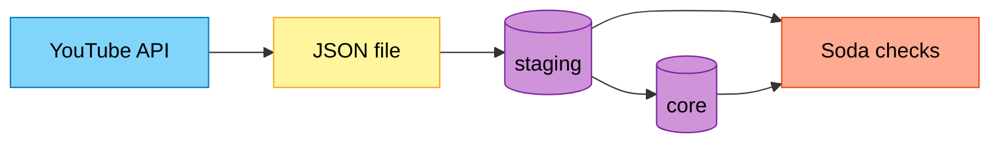

# YouTube Data ETL Pipeline

[](https://www.python.org/)
[](https://opensource.org/licenses/MIT)

An automated data engineering pipeline that extracts YouTube channel video statistics, loads them into PostgreSQL using a **staging → core** warehouse pattern, validates data quality with **Soda**, and orchestrates the full workflow with **Apache Airflow** in Docker—with **GitHub Actions** for CI/CD.

---

## Project overview

This project implements an end-to-end **ELT** pipeline for a configurable YouTube channel (via `CHANNEL_HANDLE`). It removes manual API and database work by:

1. **Extracting** video metadata and engagement metrics from the **YouTube Data API v3** (playlist → video IDs → video statistics).
2. **Loading** a daily JSON snapshot, then upserting into a **staging** schema in PostgreSQL.
3. **Transforming** records into a **core** schema (business rules such as video type and normalized duration).
4. **Validating** both layers with **Soda** (missing/duplicate keys, sanity checks on metrics).

Three Airflow DAGs run in sequence via `TriggerDagRunOperator`: `produce_json` → `update_db` → `data_quality`. The first DAG is scheduled daily; the others are triggered when the previous stage completes.

---

## Architecture

| Stage | What happens |
|-------|----------------|
| **Extract** | Airflow TaskFlow tasks call the YouTube Data API and write `youtube_data_YYYY-MM-DD.json` under `/opt/airflow/data`. |
| **Load** | Python tasks read JSON, create schemas/tables if needed, and upsert into `staging.youtube_elt` by `Video_ID`. |
| **Transform** | Core tasks read staging, apply transformations, and load `core.youtube_elt`. |
| **Quality** | Soda scans `staging` and `core` using checks defined in `include/soda/checks.yml`. |



| DAG | Schedule | Role |
|-----|----------|------|
| `produce_json` | Daily (`@daily`) | API extract → JSON → trigger warehouse DAG |
| `update_db` | Triggered | Staging load → core transform → trigger quality DAG |
| `data_quality` | Triggered | Soda on `staging`, then `core` |

---

## Tech stack

| Area | Technology |
|------|------------|
| **Language** | Python 3.12 |
| **Orchestration** | Apache Airflow 3.0 (CeleryExecutor, TaskFlow, `TriggerDagRunOperator`) |
| **Data source** | YouTube Data API v3 |
| **Database** | PostgreSQL (`staging`, `core`, Airflow metadata, Celery result backend) |
| **Broker** | Redis |
| **Data quality** | Soda Core (Postgres) |
| **Runtime** | Docker, Docker Compose, custom image on Docker Hub |
| **CI/CD** | GitHub Actions (image build/push, pytest, `airflow dags test`) |
| **Testing** | pytest (unit + integration) |

---

## Repository layout

```
dags/                 DAGs: API extract, warehouse, Soda quality
include/soda/         Soda datasource config and checks
tests/                Unit and integration tests
Dockerfile            Custom Airflow image (constraints-based deps)
docker-compose.yaml   Airflow Celery stack (+ `ci` Postgres profile)
.github/workflows/    CI/CD pipeline
```

---

## License
